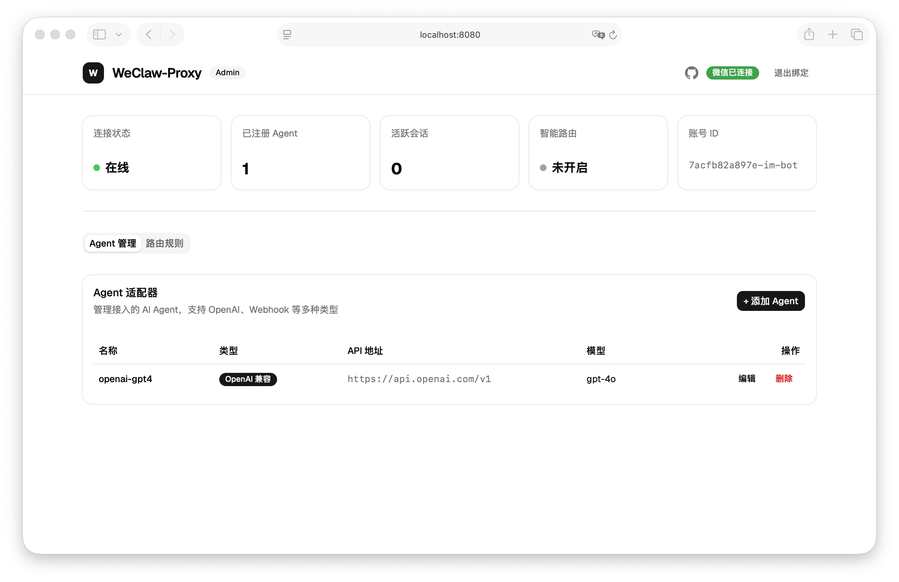
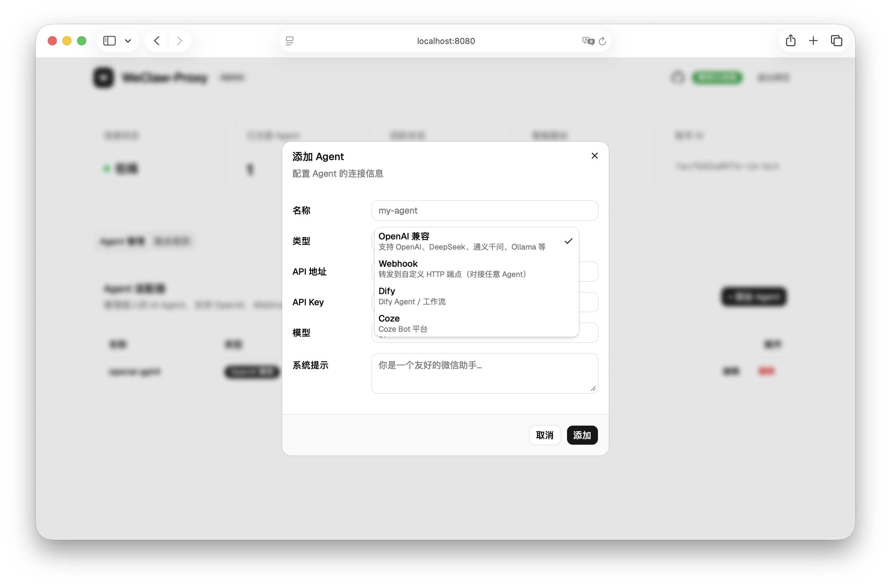
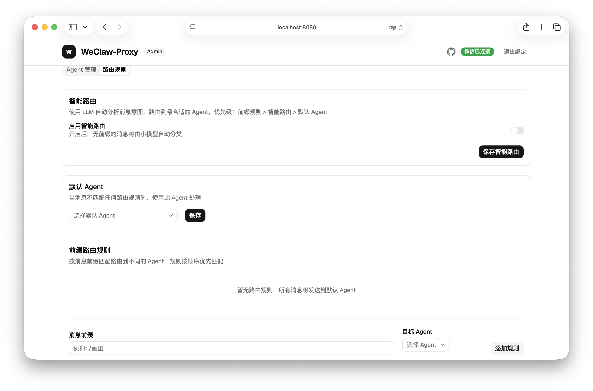
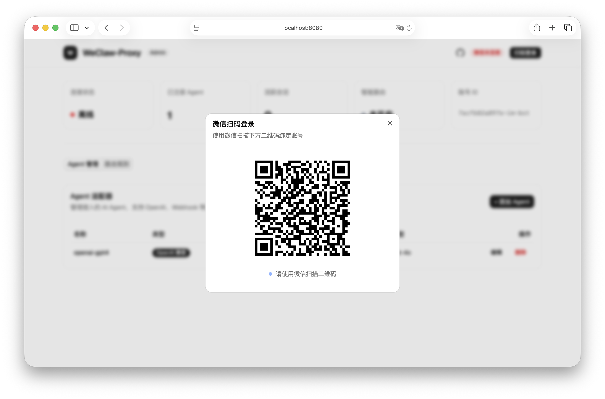

# WeClaw-Proxy

> 微信开放平台 AI Agent 代理适配器 —— 让任意 AI Agent 一键对接微信

## ✨ 特性

- 🔌 **多 Agent 接入** — 支持 OpenAI、DeepSeek、Ollama、Dify、Coze、自定义 Webhook
- 🧠 **智能路由** — LLM 驱动的消息自动分类，也支持前缀 `/command` 手动路由
- 🖥️ **Web 管理面板** — 全功能可视化配置，所有改动实时同步到 YAML
- 📱 **扫码登录** — 网页端扫码，一步绑定微信
- 💬 **会话管理** — 自动维护上下文和对话历史
- 🐳 **跨平台部署** — 二进制 / Docker 一键启动，支持 Linux / macOS / Windows

## 📸 截图

| 面板总览 | 添加 Agent |
|:---:|:---:|
|  |  |

| 路由规则 | 扫码登录 |
|:---:|:---:|
|  |  |

## 🚀 快速开始

### Docker（推荐）

```bash
# 1. 创建配置文件
curl -o config.yaml https://raw.githubusercontent.com/amigoer/weclaw-proxy/main/configs/config.example.yaml
# 编辑 config.yaml，填入你的 Agent API Key

# 2. 启动
docker run -d \
  --name weclaw-proxy \
  -v ./config.yaml:/data/config.yaml \
  -p 8080:8080 \
  ghcr.io/amigoer/weclaw-proxy:latest

# 3. 打开 http://localhost:8080 扫码登录微信
```

### 二进制部署

从 [Releases](https://github.com/amigoer/weclaw-proxy/releases) 下载对应平台的二进制文件：

```bash
# 下载并运行
chmod +x weclaw-proxy-linux-amd64
./weclaw-proxy-linux-amd64 --config config.yaml
```

### 从源码构建

```bash
git clone https://github.com/amigoer/weclaw-proxy.git
cd weclaw-proxy
make        # 构建前端 + Go 二进制
make dev    # 开发模式运行
```

## ⚙️ 配置示例

```yaml
server:
  port: 8080

weixin:
  app_id: "your-app-id"

adapters:
  - name: "openai-gpt4"
    type: openai
    api_key: "sk-xxx"
    base_url: "https://api.openai.com/v1"
    model: "gpt-4o"
    system_prompt: "你是一个友好的微信助手"

routing:
  default_adapter: "openai-gpt4"
  rules:
    - match:
        prefix: "/claude"
      adapter: "claude"

# 智能路由（可选）
smart_routing:
  enabled: false
  api_key: "sk-xxx"
  model: "gpt-4o-mini"
```

> 💡 所有配置都可以在 Web 管理面板中在线编辑，无需手动修改 YAML 文件。

## 📦 支持的平台

| 平台 | AMD64 | ARM64 |
|------|:-----:|:-----:|
| Linux | ✅ | ✅ |
| macOS | ✅ | ✅ |
| Windows | ✅ | ✅ |
| Docker | ✅ | ✅ |

## 📄 License

MIT
